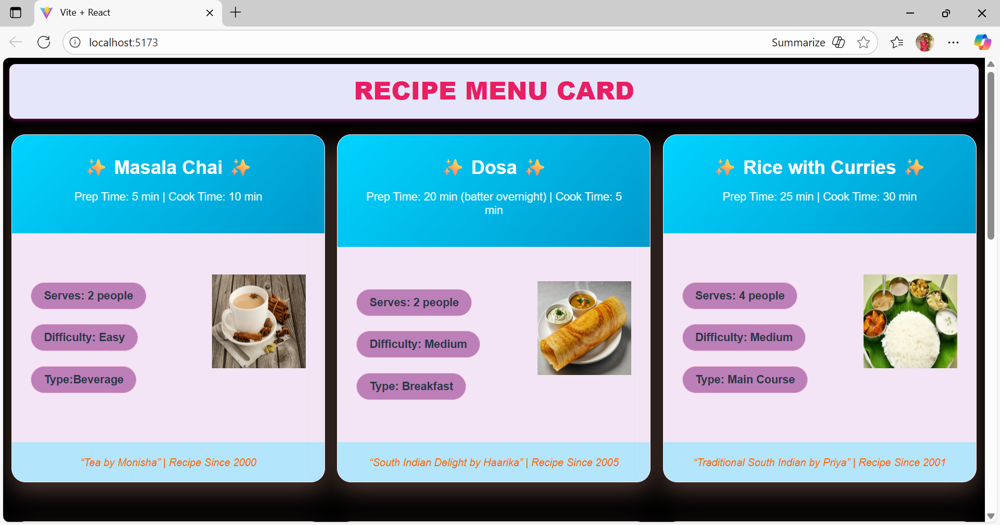

#  React Array Rendering – Recipe Menu Cards

This project is part of my **React learning journey**, where I practiced **array rendering** using the `.map()` function.  
The project dynamically displays recipe menu cards based on an array of data, making the UI scalable and reusable.

---

## 🚀 Features
- ✅ Renders multiple recipe cards using **array `.map()`**
- ✅ Clean and reusable component design
- ✅ Beginner-friendly React concept implementation
- ✅ Easy to extend with more recipes

---

## 🖼️ Project Screenshot
For Example here’s how it looks:



---

## 🛠️ Tech Stack
- **React** (Vite)
- **JavaScript**
- **CSS3** (Flexbox/Grid for layout)

---

## 📌 Future Enhancements
- Add images of recipes on each card
- Show nutritional info & calories
- Search & filter recipes

---

## 📂 Project Setup
1. Clone the repo:
   ```bash
   git clone https://github.com/tgmonisha/React_Array_Rendering.git
   cd React_Array_Rendering

2. Install Dependencies:
   
   npm install
4. Run the Project:
   
   npm run dev   

   
